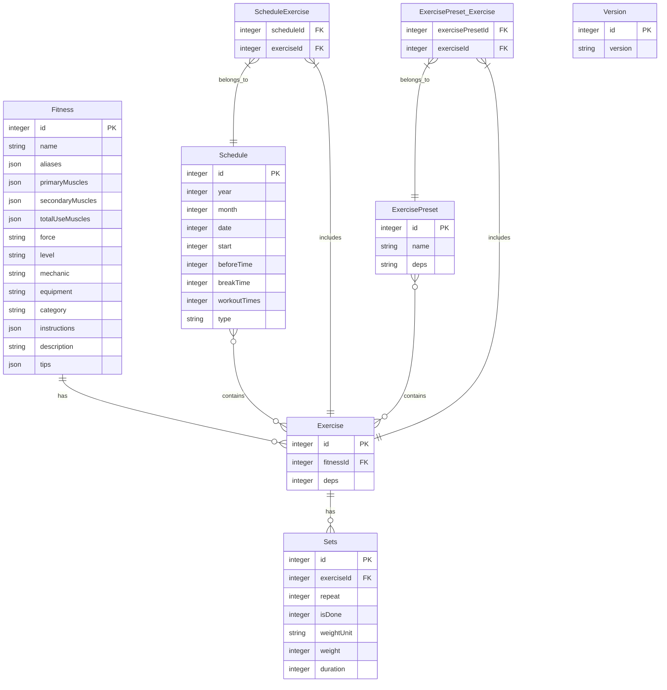

# SQLite Worker

이 패키지는 웹 애플리케이션에서 SQLite 데이터베이스를 웹 워커를 통해 관리하는 유틸리티입니다.

## 새로운 버전 설정
새로운 버전을 만들 경우 package.json의 version을 올려주세요.
해당 버전을 애플리케이션 버전(`__APP_VERSION__`)로 활용하고 있습니다.

## 마이그레이션 추가 방법

새로운 마이그레이션을 추가하려면 다음 단계를 따르세요:

1. 적절한 테이블 생성 파일(`src/create/` 디렉토리 내)에서 `migrate` 함수를 수정합니다.
2. 새로운 버전 번호를 사용하여 마이그레이션 쿼리를 추가합니다.

예시:

```typescript
export function migrate(bus: MigrationQueryBus, v: Versions) {
  // 기존 마이그레이션 코드...
  
  // 새로운 마이그레이션 추가
  if (isNewVersion(v, '1.4.0')) {
    const queryList = bus.get('1.4.0') || []
    queryList.push({
      sql: 'ALTER TABLE your_table ADD COLUMN new_column TEXT',
      args: []
    })
    bus.set('1.4.0', queryList)
  }
}
```

3. 필요한 경우 `Version.ts` 파일에서 버전 관련 로직을 업데이트합니다.

### 마이그레이션 동작 방식

마이그레이션은 다음과 같이 작동합니다:

1. 애플리케이션이 시작될 때 현재 데이터베이스 버전을 확인합니다.
2. 현재 버전이 애플리케이션 버전(`__APP_VERSION__`)과 다른 경우:
   - 각 테이블 모듈의 `migrate` 함수가 호출됩니다.
   - 버전별로 마이그레이션 쿼리가 수집됩니다.
   - 버전을 정렬하여 순서대로 마이그레이션이 실행됩니다.
   - 트랜잭션 내에서 모든 마이그레이션이 실행됩니다.
    - 실패한 경우 rollback을 진행하게 됩니다.
    - 트랜지션이 성공하면 버전 정보 업데이트를 마지막으로 sqlite파일에 반영합니다.

## ERD (Entity Relationship Diagram)



## 사용 방법

```typescript
// 예시 코드
import { SqliteWorker } from 'sqlite-worker';

// SQLite 워커 초기화
const worker = new SqliteWorker();

// 데이터 조회 예시
const results = await worker.selects('SELECT * FROM fitness LIMIT 10');
``` 